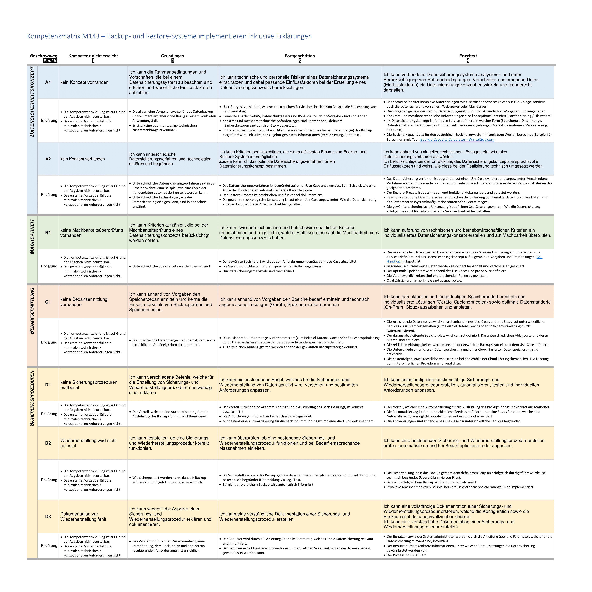
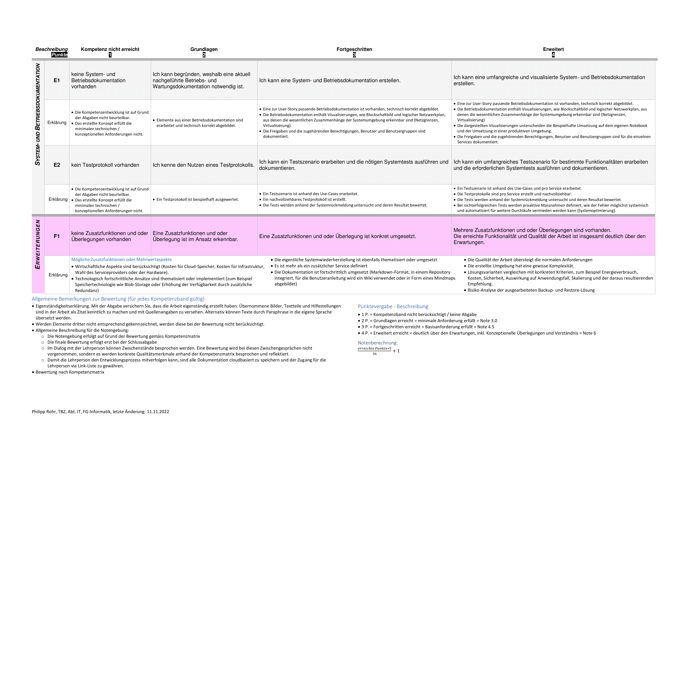

# Backup - OrgInv

## Introduction

In this module, we have been assigned the task of implementing a backup solution for a fictional organization called OrgInv. The backup solution needs to comply with the guidelines provided below.

These guidelines are divided into six different category which are provided below.

1. **Data security concept:**

    This category focuses on the concept of data security and ensuring that the backup solution incorporates appropriate measures to protect the organization's data from unauthorized access, loss, or corruption.

2. **Feasibility:**

    This category pertains to assessing the feasibility of the backup solution. It involves evaluating factors such as cost, resources, time, and technical requirements to determine if the proposed backup solution is practical and achievable.

3. **Needs assessment:** 

    This category involves conducting a thorough assessment of the organization's backup needs. It includes identifying the critical data that needs to be backed up, determining the frequency of backups, and understanding any specific requirements or constraints.

4. **Security procedures:**

    This category focuses on establishing security procedures for the backup solution. It includes defining access controls, encryption methods, authentication mechanisms, and other security measures to ensure the confidentiality, integrity, and availability of the backed-up data.

5. **System and operational documentation:** 

    This category emphasizes the importance of documenting the backup solution. It involves creating detailed documentation that outlines the system architecture, configuration settings, backup procedures, recovery processes, and any other relevant information for effective operation and maintenance of the backup solution.

6. **Extensions:** 

    This category refers to any additional considerations or extensions that need to be taken into account while implementing the backup solution. These could include integration with existing systems, scalability requirements, disaster recovery planning, or any other specific requirements unique to the organization.

## Task explaination

As previously articulated, the primary objective of this module is to proficiently strategize and execute a backup solution for an organization based on the given guidelines.

To facilitate this project, I have created a imaginary corportaion specializing in warehouse management and customer-centric solutions.

Within this hypothetical context, I have assumed the role of an external professional tasked with orchestrating the migration of the pre-existing on-premises infrastructure into a cloud-based environment.

This imaginary corporation is a mega corporation that is based in Europe. Their name is OrgInv.

OrgInv is a fictional corporation that originated in Geneva, located in central Europe. OrgInv was established by Frédéric Valmouz in the 1950. Since then they grew by approximately 10'000%. With their numbers now boasting 5000 employees world wide.