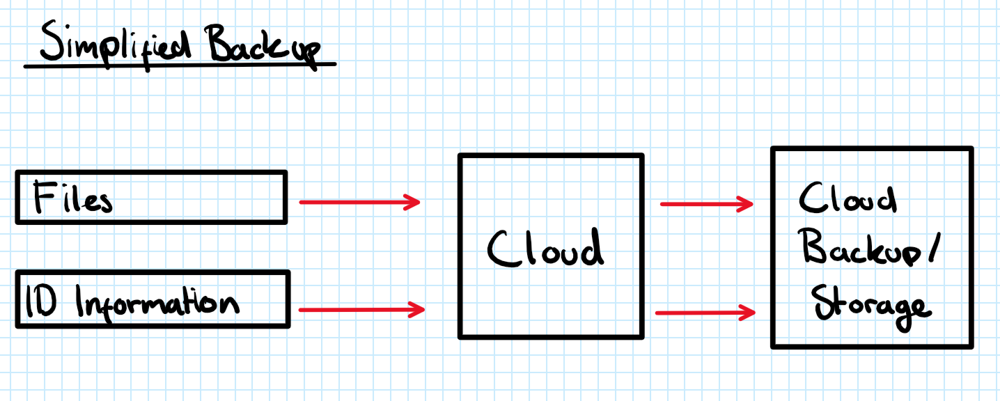
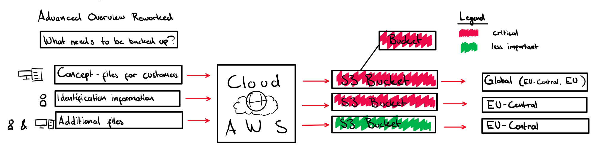

# Backup - OrgInv

## Introduction

OrgInv&trade; is a dynamic and specialized organization dedicated to impeccably catering to the multifaceted needs of businesses. Renowned for its unwavering commitment to excellence, OrgInv&trade; has perfected the art of crafting meticulously constructed business plans that go above and beyond to fulfill every conceivable requirement of its diverse clientele.

OrgInv&trade; holds the utmost priority in ensuring the safety and security of its wide-ranging clientele. This commitment is fortified by harnessing the cutting-edge capabilities of cloud computation technology. By leveraging the power of cloud computing, OrgInv&trade; not only demonstrates its dedication to safeguarding its clients but also underscores its innovative approach to delivering top-tier protection.

In ths imaginative scenario, I will take on the role as an external professional. I have to design and implement a backup concept, that ensures the safety, security and integrity of OrgInv's&trade; infrastructure on the cloud. OrgInv&trade; has asked an external professional to help out their team.

OrgInv's&trade; demands that only specific dataset get secured, since they don't want all their data on the cloud. They also prohobited the extranal professional from interacting with some of their sensitive information.

OrgInv&trade; tasked the external professional to backup their own concepts on a set interval of every ``5 days``. They also asked him to make a backup of their Identification data on a set interval of every ``day``

## Backup concept overview
Let me provide an executive summary of my backup concept by providing a high-level overview with the help of a concept plan.

In this high-level overview you see that I have defined what Informations I need to backup into the cloud.

### Extensive concept overview
In this concept plan I have scaled up all these 

